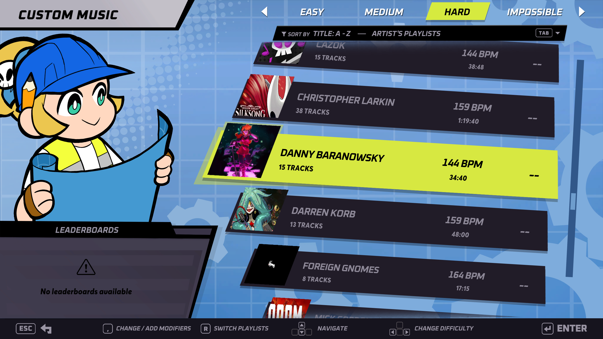

# **Rift Of The NecroDancer Playlists**

**Rift Of The NecroDancer Playlists** is a mod for Rift Of The NecroDancer that add support for playlists inside the Custom Music menu. With this mod you can browse your tracks through a series of playlists:
- **Artist playlists** : one playlist is created for each original music composer.
- **Stage creator playlists** : one playlist is created for each stage creator.
- **Custom playlists** : you can load your own playlists.
- **Editor tracks** : a playlist that contains all the local tracks not available in the workshop i.e. the ones you are working on with the editor.
- **All tracks** : you still have access to a playlist that contains all your tracks like before.

You may also want to have a look at the [Rift Of The NecroManager](https://github.com/96-LB/RiftOfTheNecroManager) mod to have in-game access to the mod settings.

## Installation

**Rift Of The NecroDancer Playlists** runs on BepInEx 5. In order to use this mod, you must first install BepInEx into your Rift Of The NecroDancer game folder. A more detailed guide can be found [here](https://docs.bepinex.dev/articles/user_guide/installation/index.html), but a summary is provided below. If BepInEx is already installed, you can skip the next subsection.

### Installing BepInEx

1. Navigate to the latest release of BepInEx 5 [here](https://github.com/BepInEx/BepInEx/releases).

    > ⚠️ This mod is only tested for compatibility with BepInEx 5. If the above link takes you to a version of BepInEx 6, check out [the full list of releases](https://github.com/BepInEx/BepInEx/releases).

2. Expand the "Assets" tab at the bottom and download the correct `.zip` file for your operating system.

    > ℹ️ For example, if you use 64-bit Windows, download `BepInEx_win_x64_5.X.Y.Z.zip`.

4. Extract the contents of the `.zip` file into your Rift Of The NecroDancer game folder.

    > ℹ️ You can find this folder by right clicking on the game in your Steam library and clicking 'Properties'. Then navigate to 'Installed Files' and click 'Browse'.

6. If you're on Mac or Linux, configure Steam to run BepInEx when you launch your game. Follow the guide [here](https://docs.bepinex.dev/articles/advanced/steam_interop.html).

7. Run Rift Of The NecroDancer to set up BepInEx.

    > ℹ️ If done correctly, your `BepInEx` folder should now contain several subfolders, such as `BepInEx/plugins`.

### Installing **Rift Of The NecroDancer Playlists**

1. Navigate to the latest release of  **Rift Of The NecroDancer Playlists** [here](https://github.com/YellowWaitt/RiftOfTheNecroDancerPlaylists/releases/latest).

2. Expand the "Assets" tab at the bottom and download the `RiftOfTheNecroDancerPlaylists.zip` archive.

3. Extract the archive in the `BepInEx/plugins` directory inside the Rift Of The NecroDancer game folder.

   > ℹ️ You can find this folder by right clicking on the game in your Steam library and clicking 'Properties'. Then navigate to 'Installed Files' and click 'Browse'.

4. Check that your mod is working by launching the game and opening the Custom Music menu. You should see that your tracks have been replaced by playlists !

## Custom Playlists

To load your own playlists into the game, create a file named `playlists.json` and place it inside the mod folder next to `RiftOfTheNecroDancerPlaylists.dll`.

> ⚠️ Be careful to not delete your collection when you update the mod. Make sure to keep an up-to-date copy of the file elsewhere.

<code>playlists.json</code> example :

<pre><code class="language-json">{
  "Playlists": [
    {
      "Name": "Hollow Knight: Silksong - Community Collab Pack",
      // Optionnal collection's id from the workshop
      // https://steamcommunity.com/sharedfiles/filedetails/?id=3584466711 <- Extract the id
      "WorkshopId": "ws3584466711",
      // This can be any id from any track you have downloaded
      "Cover": "ws3587608442",
      // With cutsom track order the tracks will be displayed with this order
      "Tracks": [
        // https://steamcommunity.com/sharedfiles/filedetails/?id=3587602756 <- Extract the id
        "ws3587602756",
        "ws3587608674",
        "ws3587521763",
        "ws3587634913",
        "ws3556185474",
        "ws3587582407",
        "ws3587633835",
        "ws3587154925",
        "ws3587634911",
        "ws3587644430",
        "ws3587639663",
        "ws3587620873",
        "ws3587520892",
        "ws3587364306",
        "ws3587593647",
        "ws3592395147",
        "ws3587357335",
        "ws3570381252",
        "ws3587598376",
        "ws3586784124",
        "ws3587603400",
        "ws3587603516",
        "ws3587461263",
        "ws3587893900",
        "ws3587629925",
        "ws3587371041",
        "ws3587607470",
        "ws3587318904",
        "ws3587639983",
        "ws3587357939",
        "ws3587608442"
      ]
    },
    // You can chain with any number of playlists
    {
      "Name": "The Sinister Minds Collection",
      "WorkshopId": "ws3653987350",
      "Cover": "ws3653440438",
      "Tracks": [
        "ws3653440438",
        "ws3653440832",
        "ws3653441097",
        "ws3653441326",
        "ws3653441551",
        "ws3653441903",
        "ws3653442101",
        "ws3653442263",
        "ws3653442448",
        "ws3653442673",
        "ws3653442944",
        "ws3653443329",
        "ws3653443601",
        "ws3653443885",
        "ws3653444093"
      ]
    }
  ]
}
</code></pre>

